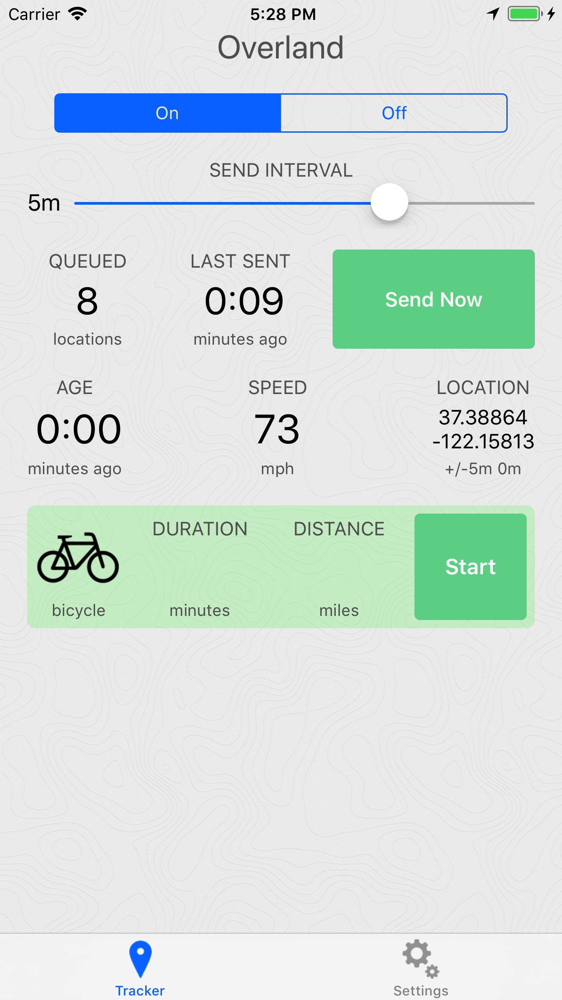
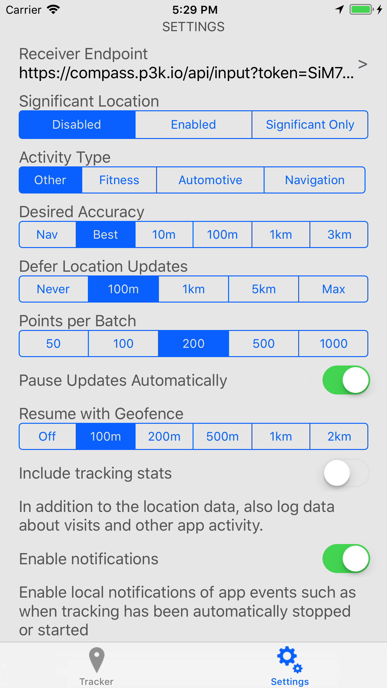

Overland GPS Tracker for iOS
============================

This app tracks your location in the background and sends the data to a server of your choosing. The app tracks:

* GPS location
* Motion State (walking, running, driving, cycling, stationary)
* Battery level

The app gathers data even when the phone is offline, and the data is sent to the server in a batch at an interval set by the user.

There are many settings available in the settings tab which allow you to adjust properties of the CoreLocation API.

The app sends data to an HTTP endpoint. You can use an existing backend or build your own. The app works with:

* [Compass](https://github.com/aaronpk/Compass) - a self-hosted PHP app built to save and review data from this app
* [PureTrack](https://puretrack.io/add-overland) - a service for tracking lightweight planes and gliders
* [Open Humans](https://overland.openhumans.org/) - a service for tracking your data and sharing it for research purposes
* [Icecondor](https://icecondor.com/) - a service for tracking your location, sharing with friends, and setting geofence alerts

Looking for the Android version? → https://github.com/OpenHumans/overland_android

## Documentation

### Tracker Screen


The Tracker screen is where you control whether the app is active, and shows you some basic stats of what the app is doing. This is also where you start and stop trips.

<!-- * Top line - The top line will indicate the database name being reported to if you are using the [Compass](https://github.com/aaronpk/Compass) tracking server. -->
* `Age` - The age of the last location point that was reported by the OS. You can use this to get a sense of how much data you are recording.
* `Location` - Shows the latitude/longitude, accuracy, and altitude of the last location update received.
* `Speed` - The speed of the last location update received. Below the speed you'll see the activity type, such as "stationary" or "driving".
* `Queued` - This number indicates how many location points are stored in the application's internal database that are not yet sent.
* `Last Sent` - Indicates how long ago the last batch was successfully sent to the server.
* `Send Now` - Tapping this button will send the queued data to the server immediately.
* `Send Interval` - This slider controls the interval at which the app sends data to the server. Using the network connection is a huge source of battery drain, so you can save battery by sending infrequently to the server. The slider's range is from 1 second to 30 minutes, and the rightmost option is "off" which disables sending. This is useful when you know you don't have a network connection such as during flights. Data is queued up and will be sent once you enable sending later.
* `Icon` - This icon indicates the mode of transport that will be written for the trip record.
* `Duration` - When a trip is active, indicates how long the trip has been going for.
* `Distance` - When a trip is active, indicates how far has been traveled in this trip.
* `Start/Stop` - Starts and stops a trip record. After stopping a trip, the trip record is written to the database and sent to the server along with the location points.
<!-- * `DB` - This debugging line reports how many of the various types of records are currently stored in the DB waiting to be sent. -->


### Settings



The Settings screen allows you to set the parameters of the iOS CoreLocation API, which gives you fine-grained control over how the tracker behaves.

These controls all set various properties of the CoreLocation LocationManager object. It is worth reading the [iOS documentation](https://developer.apple.com/reference/corelocation) for more details, but a summary of them is below.

* `Receiver Endpoint` - Tap this line to set the endpoint that the app will send data to. You can also configure a device ID which will be included in each record, and an access token which will be sent in the HTTP Authorization header.
* `On/Off` - The "Tracking Enabled" switch enables and disables tracking globally. When it's set to off, the app stops requesting location updates, and won't record or send any more data.

**iOS Settings**

The settings in this section set properties on the CoreLocation API. They are meant to give you direct control over how you want to tell the operating system to deliver data to the app.

* `Tracking Mode`
  * Setting to "Standard" will request continuous location updates in the background. Use this if you want to be able to draw detailed tracks of your travels.
  * Setting to "Significant Location" will register for [significant location changes](https://developer.apple.com/reference/corelocation/cllocationmanager/1423531-startmonitoringsignificantlocati). Significant change events are triggered for example when you move to a new cell tower or when your nearby visible wifi access points change. It's not an exact science, and may be triggered more or less often than you expect. This will result in _much less_ data collected, but will also use barely any noticeable battery.
* `Desired Accuracy` - Sets the [desiredAccuracy](https://developer.apple.com/reference/corelocation/cllocationmanager/1423836-desiredaccuracy) property of the location manager. This is only a request for the general level of accuracy, not a guarantee. Setting to "Best" will use the most battery but will get highest accuracy location updates. Setting to "3km" will save the most battery but will result in infrequent location updates.
* `Activity Type` - According to Apple, "The location manager uses the information in this property as a cue to determine when location updates may be automatically paused.". See [activityType](https://developer.apple.com/reference/corelocation/cllocationmanager/1620567-activitytype) for more details.
* `Show Background Location Indicator` - Setting this to "Always" will cause the location indicator in your iOS menu bar to be activated whenever the app is tracking your location. With the visible indicator, your app is more likely to continue to receive data in the background according to [this post on the Apple forums](https://developer.apple.com/forums/thread/726945). Setting this to "During Trips" will only set the corresponding iOS setting when you start a trip. Setting this to "Never" will not set the iOS setting, although you may still see the indicator based on Apple's own logic.
* `Pause Updates Automatically` - Enabling this will use the iOS API for automatically pausing location updates. When disabled, it will prevent the OS from pausing location updates. Pausing location updates automatically is a great way to save battery when you are not moving for extended periods of time, although it does not always pick up tracking again immediately when you start moving. In some initial testing, the automatic pause tends to trigger about 10 minutes after you've stopped moving.
* `Location Authorization Status` - When you first launch the app, you'll need to request location permissions from the button here. Once you've requested permission twice, you should see it say "Always", which means the app will be able to collect data in the background. If you change the value in the iOS Settings app, this will show you the current status to help you troubleshoot why the app isn't getting updates in the background anymore.

**Overland Settings**

The settings in this section control features specific to the Overland app.

* `Logging Mode` - Whether you want Overland to log all data or only log the most recent point. If you configure the endpoint URL to send data in the query string then you should set this to "Only Latest". Experiment with the other settings to control how frequently you get data sent from the app.
* `Points per Batch` - Controls the number of location updates that will be sent with each HTTP request. Setting this to 50 will mean more requests to the server are required to flush the queue, but each request will be smaller. Setting this to 1000 means you'll be able to flush the queue with fewer requests, but each request will be much larger. Each location point can be around 600 bytes when serialized as JSON, so sending 1000 points in a request will mean the request body may be around 600kb. Lower batch sizes are likely better for flaky network connections, and larger batch sizes are good when on a reliable connection. Note that this does not affect the frequency at which data is sent to the server.
* `Resume with Geofence` - This is an attempt at overcoming the limitations of the "Pause Updates Automatically" feature. Setting a radius here will register an "exit" geofence whenever location updates are paused at that location. This will attempt to get the app woken up when the user leaves the area again, and when triggered, will resume tracking with the previous settings.
* `Discard Points Closer Than` - When set, the app will discard any location updates within the distance selected. For example you can set the value to 50 meters to only record an update if the phone moves 50 meters from the last location. Note: This does not have a noticeable effect on battery life, since the OS will have already delivered the location data to the app by this point.
* `Min Time Between Points` - When set, the app will discard any location updates received within the selected amount of time. For example you can set the value to 10 seconds to record an update at most every 10 seconds. Note: This does not have a noticeable effect on battery life, since the OS will have already delivered the location data to the app by this point. The default is 1 second.
* `Enable notifications` - Toggle whether the app should send push notifications about events such as when tracking has been automatically stopped and started.
* `Prevent screen lock during trip` - When enabled, your phone screen should not go to sleep when there is a trip active.
* `Configure Wifi Zone` - You can configure a wifi zone to force the app to report an exact location whenever you're connected to a specific wifi SSID. This is useful if you don't want to collect a bunch of noisy data when you're at home.

**System Settings**

There are some additional settings in the iOS Settings app that are not exposed in the app interface itself. This is for settings that are infrequently changed or uncommon.

* `Include tracking stats` - Toggle whether to include visit and app metadata in the log as well. This is useful when trying to understand the app lifecycle and how the various tracking settings affect the app's behavior, but you probably don't want it enabled for production passive tracking usage.
* `Consider HTTP 2XX Successful` - By default, the server has to respond with a specific JSON response (`{"result":"ok"}`) in order to tell the app it has received the data and to delete the stored cache. Turning this on will consider any HTTP 2xx response code successful. Only use this if you are unable to send the JSON response from your server software, as this may inadvertently lose data if your server has errors.
* `Include Unique ID in Logs` - Turn this on to include an additional `unique_id` in every record. This is the phone's "Unique ID" generated by Apple. The value cannot be customized, so you can use it as a reliable way to identify unique devices.


#### Configuration by Custom URL

You can send people a custom URL that will configure the app by clicking on it. Create a URL with your endpoint, token and device ID like the following:

```
overland://setup?url=https%3A%2F%2Fexample.com%2Fapi&token=1234&device_id=1&unique_id=yes
```

Tapping that URL on a device with the app installed will launch the app and save the values in the configuration. This is a quick way to configure many devices since it bypasses the need to enter the values in the settings screen.

Query Parameters:

* `url` - The server URL to post data to
* `token` - The access token to use in requests
* `device_id` - Set the user-defined device ID here
* `unique_id=yes` - Set this to `yes` to toggle the "Unique ID" setting


### Usage Profiles

You should decide what kind of data you are hoping to get out of this application. The controls provided will give you a lot of knobs you can turn to adjust the way the app collects data. Below are some recommended presets for different applications.


#### High Resolution Tracking

To get high resolution data, you should set the following:

* Pause Updates Automatically: Off
* Resume with Geofence: Off
* Tracking Mode: Standard
* Activity Type: Other
* Desired Accuracy: Best
* Defers Location Updates: 100m or 1km

While moving, you will receive up to one point per second. When you're not moving, such as when you're at your desk, etc, there may be several minutes between location updates received. This will use a lot of battery, but will result in data that can be used to generate a picture similar to this level of detail.


#### Battery Saving / Low Resolution

To use very little battery, you can still get enough location info to know what neighborhood you're in, and likely also when you leave and return home.

* Pause Updates Automatically: On
* Resume with Geofence: 500m
* Tracking Mode: Significant Location
* Activity Type: Other
* Desired Accuracy: 100m

This will use much less battery than high resolution, while still gathering enough data you can use to roughly geotag posts or know what neighborhood you're in. For even more battery savings, you can set Significant Location Only, which will drastically reduce the amount of data you log but will use almost no battery.


## API

The app will post the location data to the configured endpoint.

If the endpoint URL has any template parameters, they will be replaced with the value of the most recent location update. The template parameters you can use are below:

* `%TS` - Timestamp (ISO 8601, e.g. `2023-12-05T16:50:25Z`)
* `%LAT` - Latitude
* `%LON` - Longitude
* `%SPD` - Speed in meters per second (negative means invalid)
* `%ACC` - Accuracy (horizontal) of location in meters
* `%ALT` - Altitude in meters
* `%BAT` - Battery percent (e.g. `0.8` for 80%)

For example, you can use the URL below to receive all the data in the query string:

```
https://example.com/input?ts=%TS&lat=%LAT&lon=%LON&acc=%ACC&spd=%SPD&bat=%BAT&alt=%ALT
```

The POST request body will be a JSON object containing a property `locations` which is an array of GeoJSON objects. The default batch size is 200 but can be set in the settings. This request will look something like the following:

```
POST /api HTTP/1.1
Authorization: Bearer xxxxxx
Content-Type: application/json

{
  "locations": [
    {
      "type": "Feature",
      "geometry": {
        "type": "Point",
        "coordinates": [
          -122.030581, 
          37.331800
        ]
      },
      "properties": {
        "timestamp": "2015-10-01T08:00:00-0700",
        "altitude": 0,
        "speed": 4,
        "horizontal_accuracy": 30,
        "vertical_accuracy": -1,
        "motion": ["driving","stationary"],
        "pauses": false,
        "activity": "other_navigation",
        "desired_accuracy": 100,
        "deferred": 1000,
        "significant_change": "disabled",
        "locations_in_payload": 1,
        "battery_state": "charging",
        "battery_level": 0.80,
        "device_id": "",
        "wifi": ""
      }
    }
  ],
  "current": { ... }, (optional)
  "trip": { ... } (optional)
}
```

If you've configured an access token, it will be sent in the HTTP `Authorization` header preceded by the text `Bearer`.

The properties on the `location` objects are as follows:

* `timestamp` - the ISO8601 timestamp of the `CLLocation` object recorded
* `altitude` - the altitude of the location in meters
* `speed` - meters per second
* `horizontal_accuracy` - accuracy of the position in meters
* `vertical_accuracy` - accuracy of the altitude in meters
* `motion` - an array of motion states detected by the motion coprocessor. Possible values are: `driving`, `walking`, `running`, `cycling`, `stationary`. A common combination is `driving` and `stationary` when the phone is resting on the dashboard of a moving car.
* `battery_state` - `unknown`, `charging`, `full`, `unplugged`
* `battery_level` - a value from 0 to 1 indicating the percent battery remaining
* `wifi` - If the device is connected to a wifi hotspot, the name of the SSID will be included
* `device_id` - The device ID configured in the settings, or an empty string
* `unique_id` - If "Unique ID" is enabled, the device's Unique ID as set by Apple

The following properties are included only if the "Include Tracking Stats" option is selected:

* `pauses` - boolean, whether the "pause updates automatically" preference is checked
* `activity` - a string denoting the type of activity as indicated by the setting. Possible values are `automotive_navigation`, `fitness`, `other_navigation` and `other`. This can be set on the settings screen.
* `desired_accuracy` - the requested accuracy in meters as configured on the settings screen.
* `deferred` - the distance in meters to defer location updates, configured on the settings screen.
* `significant_change` - a string indicating the significant change mode, `disabled`, `enabled` or `exclusive`.
* `locations_in_payload` - the number of locations that were sent in the batch along with this location

### Response

Your server must reply with a JSON response containing:

```json
{
  "result": "ok"
}
```

This indicates to the app that the batch was received, and it will delete those points from the local cache. If the app receives any other response, it will keep the data locally and try to send it again at the next interval.

If you are unable to return this JSON, you can set the "Consider HTTP 2XX Successful" in the Settings app, and then any HTTP 2xx response will be considered successful.

### Current Location

If the number of locations in the queue are more than twice the batch size, then the request will also contain a property `current` with the most recent location point stored by the device. (This point will not be one of the ones in the batch.) If you need your backend to be aware of the current location, this allows you to ignore the batch being uploaded and instead use just that point.


### Current Trip

If a trip is active, an object called `trip` will be included in the request as well, with information about the current trip. This object will contain the following properties:

* `distance` - current trip distance in meters as calculated by the device
* `mode` - the trip mode as a string
* `current_location` - a `location` record that represents the most recent location of the device
* `start_location` - a `location` record that represents the location at the start of the trip
* `start` - an ISO8601 timestamp representing the time the trip was started. this may be slightly different from the timestamp in the start location.


## Development Setup

This assumes you have [Xcode](https://developer.apple.com/xcode/) and [Homebrew](https://brew.sh) installed. A paid Apple Developer account is not needed.

* `git clone https://github.com/aaronpk/Overland-iOS.git && cd Overland-iOS`
* `brew install cocoapods`
* `open Overland.xcworkspace`
* In Project Navigator, select *Overland*, and update Project Settings:
    * Identity → Bundle Identifier: *com.yourname.overland*
    * Signing → Team: *Personal Team*
* Plug in your iOS device
* Product → Destination -> select your device
* Product → Run (⌘R)
* On your iOS device: Settings -> General -> Device Management -> Developer App -> Trust
* You can now launch the Overland app on your iOS device


## License

Contributions from 2017 onward are copyright by Aaron Parecki

Contributions from 2013-2016 are copyright by Esri, Inc.

Licensed under the Apache License, Version 2.0 (the "License");
you may not use this file except in compliance with the License.
You may obtain a copy of the License at

http://www.apache.org/licenses/LICENSE-2.0

Unless required by applicable law or agreed to in writing, software
distributed under the License is distributed on an "AS IS" BASIS,
WITHOUT WARRANTIES OR CONDITIONS OF ANY KIND, either express or implied.
See the License for the specific language governing permissions and
limitations under the License.


